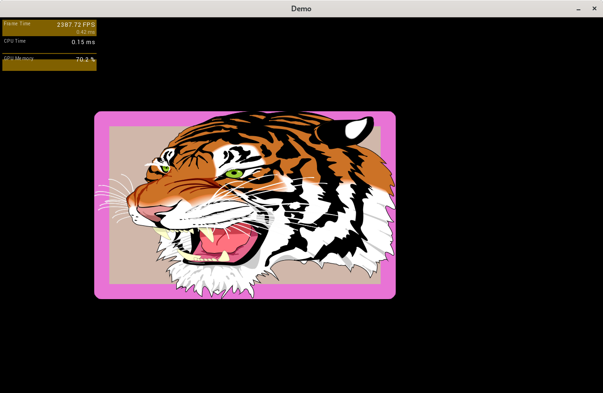

# MulleGLExample




## Progress

* 26.2.2019: Improved SVG drawing with patched nanovg
* 26.2.2019: Redid CALayer borderWidth and cornerRadius code
* 12.2.2019: UIScrollView reacts to mouse scroll events, fixed clipping
* 22.1.2019: UIButton now reacts to clicks and shows state, fixed colors and window drag
* 15.1.2019: can now distribute mouse events to proper subviews


## Build

This is a [mulle-sde](https://mulle-sde.github.io/) project.

It has it's own virtual environment, that will be automatically setup for you
once you enter it with:

```
mulle-sde MulleGLExample
```

Now you can let **mulle-sde** fetch the required dependencies and build the 
project for you:

```
mulle-sde craft
```
